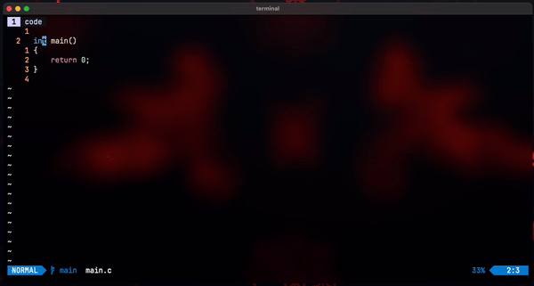

# switchboard.nvim

Neovim plugin designed to simplify the process of compiling and running projects
within tmux panes or windows. Supports multiple programming languages by
allowing customisation of build and run commands.



## Installation

Install using your favorite plugin manager. For example, using
[lazy.nvim](https://github.com/folke/lazy.nvim):
```lua
{'karshPrime/switchboard.nvim', event = 'VeryLazy', config = {
    {
        extension = {'c', 'cpp', 'h'},
        build = 'make',
        run = 'make run',
    },
    {
        extension = {'go'},
        build = 'go build',
        run = 'go run .',
    },
}},
```

## Keybinds

```lua
-- run on vertical split
vim.keymap.set('n', 'v<F5>', ':Switchboard RunV<CR>', {silent=true})

-- run on horizontal split
vim.keymap.set('n', 'h<F5>', ':Switchboard RunH<CR>', {silent=true})

-- run program in background
vim.keymap.set('n', '<leader><F5>', ':Switchboard RunBG<CR>', {silent=true})

-- compile on vertical split
vim.keymap.set('n', '<F5>v', ':Switchboard MakeV<CR>', {silent=true})

-- compile on horizontal split
vim.keymap.set('n', '<F5>h', ':Switchboard MakeH<CR>', {silent=true})

-- just compile (background window)
vim.keymap.set('n', '<F5><leader>', ':Switchboard Make<CR>', {silent=true})
```

